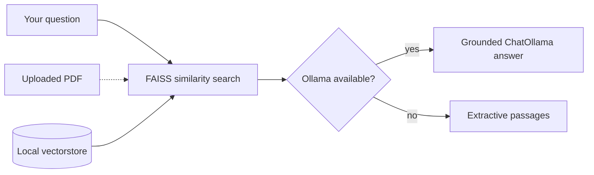

<p align="center">
  
</p>

<p align="center">
  <strong>Calm, private legal research on your device</strong><br/>
  Ask questions against a local FAISS knowledge base — public-law corpus and/or your own PDFs.<br/>
  <em>No Groq. No paid LLM APIs. Optional free generation via Ollama.</em>
</p>

<p align="center">
  <a href="#quick-start"></a>
  <a href="Personal-AI-lawyer-main/DATA.md"></a>
  
  
</p>

<p align="center">
  
  
  
  
  
</p>

---

## Why this exists

Most “AI lawyer” demos send your documents to a cloud API. This one keeps retrieval and (optionally) generation **on your machine** — useful for learning RAG, exploring public-law corpora, and researching your own PDFs without shipping them off-device.

```text
  You ask  ──▶  FAISS search (MiniLM)  ──▶  Ollama / extractive answer
     ▲                    │
     └──── upload PDF ────┘
```

## Features

| | |
|---|---|
| **Fully local RAG** | FAISS + `sentence-transformers/all-MiniLM-L6-v2` |
| **Free generation** | Ollama (`llama3.2`, `mistral`, `phi3`, …) — or extractive fallback |
| **Your documents** | Upload a PDF in the app; indexed locally for that session |
| **Mobile-first UI** | Streamlit interface tuned for phone + desktop |
| **Open corpus** | Seed texts + optional Hugging Face public-law samples |

## Quick start

```bash
git clone https://github.com/Girisankarsm/Personal-AI-Lawyer.git
cd Personal-AI-Lawyer/Personal-AI-lawyer-main

python -m venv .venv
source .venv/bin/activate          # Windows: .venv\Scripts\activate
pip install -r requirements.txt

# Optional but recommended — natural-language answers
ollama serve
ollama pull llama3.2

streamlit run app.py
```

Open the URL Streamlit prints (usually `http://localhost:8501`).

> Without Ollama, the app still works in **extractive mode**: it retrieves the most relevant passages and presents them clearly.

### Optional environment

```bash
export OLLAMA_MODEL=llama3.2
export OLLAMA_BASE_URL=http://localhost:11434
```

## How answers work



1. **Retrieve** — FAISS similarity search with MiniLM (or fine-tuned weights under `models/legal-embeddings` when present).
2. **Generate** — Ollama grounded on retrieved context, or extractive fallback.
3. **Indexes used** (first match wins):
   - `vectorstore/db_faiss_legal` — free legal corpus
   - `vectorstore/db_faiss_user` — your uploaded PDF
   - `vectorstore/db_faiss` — bundled / seed index (e.g. UDHR)

## Rebuild the knowledge base

```bash
cd Personal-AI-lawyer-main

python build_index.py --force          # download + cache HF slices
python build_index.py                  # reuse data/cache/corpus.jsonl
python build_index.py --force --skip-remote   # PDFs + seeds only
```

Details on licenses and datasets: **[DATA.md](Personal-AI-lawyer-main/DATA.md)**.

## Project layout

```text
Personal-AI-Lawyer/
├── assets/banner.svg          # animated GitHub hero
├── README.md
└── Personal-AI-lawyer-main/
    ├── app.py                 # Streamlit UI
    ├── rag_pipeline.py        # Ollama + extractive RAG
    ├── vector_database.py     # FAISS load / PDF ingest
    ├── build_index.py         # corpus → FAISS
    ├── data_ingest.py         # seed + HF loaders
    ├── DATA.md                # data source notes
    └── vectorstore/           # FAISS indexes
```

## Important disclaimer

> **Educational / research use only.** This is not a lawyer and does not provide legal advice. Laws change; corpora may be incomplete or outdated. Always verify against official primary sources and consult a licensed attorney for real legal matters.

## Stack

- **UI** — Streamlit  
- **Retrieval** — FAISS + sentence-transformers  
- **Generation** — LangChain + Ollama (`langchain-ollama`)  
- **Ingest** — pdfplumber / pypdf + optional Hugging Face `datasets`

---

<p align="center">
  <sub>Built for privacy-first legal RAG demos · Star the repo if it helps you learn</sub>
</p>
